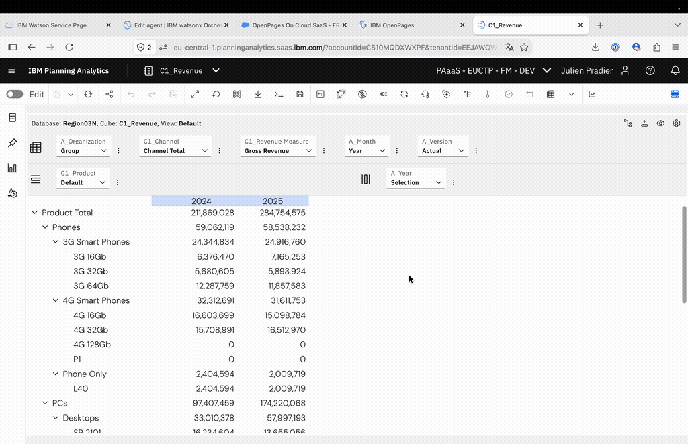
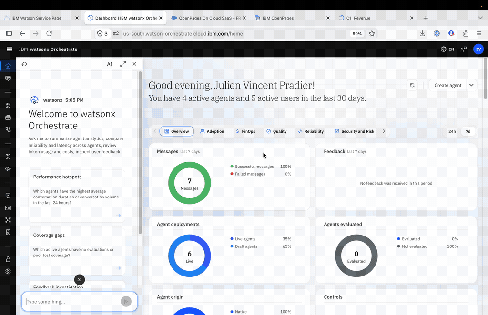
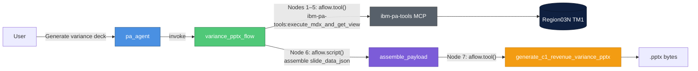

# wxo-planning — Planning Analytics Agent

Watsonx Orchestrate project wiring the **IBM Planning Analytics (TM1)** server
`Region03N` to an AI agent (`pa_agent`) that can explore cubes, manage sandboxes,
run MDX queries, and generate variance analysis PowerPoint decks.

[](https://github.com/jpradier/planning-variance-analysis)

---

## Why use watsonx Orchestrate for Planning Analytics reporting?

Planning Modelers are often tasked with producing a PowerPoint analysis out of a Planning Analytics cube. Nowadays, agentic desktop apps make that task very easy. With IBM Bob, you just need to add the `ibm-pa-tools` MCP server connected to your Planning Analytics instance and add a `pptx` skill — then simply ask Bob to generate the PowerPoint.



However, there are some caveats to this approach:

1. **Requires a local desktop AI assistant** — every user must install and configure the toolchain.
2. **Not reproducible** — each generation is a fresh LLM call; no template is enforced, so output varies run to run.
3. **Slow and resource-intensive** — it takes a long time, requires a frontier model, and a connection outside of your organisation.

IBM watsonx Orchestrate can be taught by Bob to accomplish the same task. It uses a smaller, open-source model (here `gpt-oss-120b`) that can be deployed on-premises. It is guided through a pre-defined process to gather data from the Planning Analytics cube, derive insights, and fill a PowerPoint template:



The benefits of using Orchestrate are significant:

1. **Reproducible workflow** — the same flow runs the same way every time.
2. **Enterprise template** — a common template with your organisation's graphic charter is enforced.
3. **No local install** — nothing needs to be installed on the user's machine.
4. **Bound to your organisation** — with Orchestrate, you have the option to stay within your organisation network — no data can leak outside.

This can also be deployed directly to the **Planning Analytics Chat** *(animated GIF coming soon)*.

> **Comming soon:** The video of the Chat within Planning Analytics.

---

## Project structure

```
.
├── agents/
│   └── pa_agent.yaml                          ← PA agent definition
├── tools/
│   ├── generate_c1_revenue_variance_pptx/     ← Python PPTX renderer tool
│   │   ├── py_pkg/
│   │   │   ├── generate_c1_revenue_variance_pptx.py
│   │   │   └── variance_template.pptx
│   │   ├── requirements.txt
│   │   └── import-all.sh
│   └── variance_pptx_flow/                    ← Agentic Flow (data + render)
│       ├── variance_pptx_flow.py
│       ├── main_flow.py
│       └── import-all.sh                      ← imports everything
├── toolkits/                                  ← MCP toolkit specs
└── connections/                               ← connection specs
```

---

## Agent: `pa_agent`

[`agents/pa_agent.yaml`](agents/pa_agent.yaml)

The Planning Analytics Agent is a `react_core` native agent connected to
`Region03N` via the `ibm-pa-tools` MCP toolkit. It can:

| Capability | Tools used |
|---|---|
| Data exploration | `get_data_from_data_explorer`, `execute_mdx_and_get_view`, `get_cube_dimensions`, `get_cube_sample_members` |
| Sandbox management | `create_tm1_sandbox`, `publish_sandbox`, `discard_sandbox_changes`, `delete_tm1_sandbox` |
| Views | `save_mdx_view`, `get_saved_view`, `delete_view` |
| Process management | `create_tm1_process`, `update_tm1_process`, `execute_tm1_processes_asynchronously`, `get_tm1_server_process_status` |
| Analysis | `perform_impact_analysis`, `perform_outlier_detection`, `generate_exploration_analysis_report` |
| Variance PPTX | `variance_pptx_flow` ← single invocation, all data fetching happens inside the flow |

---

## Variance PPTX feature

### Architecture



### Design decision — why a Flow?

The PPTX renderer tool (`generate_c1_revenue_variance_pptx`) is a pure
**data-in → bytes-out** function. It has no knowledge of Planning Analytics and
requires no PA credentials. Keeping it that way is intentional.

Previously, the agent was responsible for running 5 MDX queries manually and
assembling a 150-line JSON payload before calling the renderer. This made the
agent instructions brittle and verbose.

The **`variance_pptx_flow`** Agentic Flow moves the data-gathering into proper
flow nodes. Each MDX call is a `aflow.tool("ibm-pa-tools:execute_mdx_and_get_view")`
node — the MCP toolkit handles PA authentication transparently. The agent now
invokes a single flow tool.

### Flow internals

[`tools/variance_pptx_flow/variance_pptx_flow.py`](tools/variance_pptx_flow/variance_pptx_flow.py)

```
variance_pptx_flow (Agentic Flow — 7 nodes)
├── Node 1: mdx_kpi          → aflow.tool("ibm-pa-tools:execute_mdx_and_get_view")
├── Node 2: mdx_quarterly    → aflow.tool("ibm-pa-tools:execute_mdx_and_get_view")
├── Node 3: mdx_monthly      → aflow.tool("ibm-pa-tools:execute_mdx_and_get_view")
├── Node 4: mdx_product      → aflow.tool("ibm-pa-tools:execute_mdx_and_get_view")
├── Node 5: mdx_channel      → aflow.tool("ibm-pa-tools:execute_mdx_and_get_view")
├── Node 6: assemble_payload → aflow.script(...)  ← parses MDX markdown tables,
│                                                     computes stats, builds JSON
└── Node 7: render_pptx      → aflow.tool("generate_c1_revenue_variance_pptx")
                                                  ← referenced by name string (not callable)
```

Each MCP tool node receives its MDX string via `node.map_input()`. The script
node reads all 5 node outputs via `flow.<node_name>.output.data` (dot notation),
computes stats, and writes `slide_data_json` using an inline `_j()` serializer
(no `import json` — banned in script sandboxes). The renderer node uses
`input_schema=AssembleOutput` for auto-mapping with no explicit `map_input()`.

**Key `@flow` decorator flags:**
- `suppress_agent_summarization=False` — **required** to get the download link
  (the ADK default is `True`, which suppresses file rendering in the chat UI)
- No `output_schema` — omitting it lets the renderer's `bytes` pass through
  natively to the WXO file download widget

### Renderer tool

[`tools/generate_c1_revenue_variance_pptx/py_pkg/generate_c1_revenue_variance_pptx.py`](tools/generate_c1_revenue_variance_pptx/py_pkg/generate_c1_revenue_variance_pptx.py)

Accepts a single `slide_data_json` string and returns raw `.pptx` bytes.
Uses `python-pptx` to fill [`variance_template.pptx`](tools/generate_c1_revenue_variance_pptx/py_pkg/variance_template.pptx).

Output slides:

| # | Slide | Content |
|---|---|---|
| 0 | Title | Cube name, period, measure, context |
| 1 | Executive summary | KPI cards: year A total, year B total, variance $, variance %, best quarter |
| 2 | Monthly trend | Line chart Jan–Dec for both years + 3 auto-generated insights |
| 3 | C1_Product breakdown | Bar chart + stats table (Phones / PCs / Tablets) |
| 4 | C1_Channel breakdown | Bar chart + stats table (Direct / Internet / Indirect) |
| 5 | Key findings | 5-card findings grid + recommended next steps |

---

## Import & deploy

Run from the **project root**:

```bash
bash tools/variance_pptx_flow/import-all.sh
```

This imports in order:
1. `generate_c1_revenue_variance_pptx` Python tool (renderer)
2. `variance_pptx_flow` flow tool (data gathering + orchestration)
3. `pa_agent` agent

Verify:

```bash
orchestrate tools list | grep -E 'variance'
orchestrate agents list | grep pa_agent
```

---

## Prerequisites

- `orchestrate` CLI authenticated to the target watsonx Orchestrate environment
- `ibm-pa-tools` MCP toolkit registered and connected to `Region03N`
- Python dependencies (installed automatically on import): `python-pptx`

---

## Trigger phrases for the agent

The agent's starter prompts cover the most common requests:

| Prompt | What it does |
|---|---|
| *"Generate the variance analysis PPTX for C1_Revenue comparing 2024 vs 2025"* | Invokes `variance_pptx_flow` with defaults |
| *"List all cubes on Region03N"* | Calls `ibm-pa-tools:get_tm1_cubes` |
| *"Show me revenue data for this year"* | Calls `get_data_from_data_explorer` |
| *"Create a sandbox called Budget Scenario 2025"* | Calls `create_tm1_sandbox` |
| *"Run outlier detection on A_Income Statement"* | Calls `perform_outlier_detection` |

---

## Reference

- Skill used to build the renderer: [`.bob/skills/pa-variance-pptx/SKILL.md`](.bob/skills/pa-variance-pptx/SKILL.md)
- Example output deck: [`workspace/revenue-analysis/C1_Revenue_Variance_Analysis_2024_2025.pptx`](workspace/revenue-analysis/C1_Revenue_Variance_Analysis_2024_2025.pptx)
- Agent definition: [`agents/pa_agent.yaml`](agents/pa_agent.yaml)
- Flow: [`tools/variance_pptx_flow/variance_pptx_flow.py`](tools/variance_pptx_flow/variance_pptx_flow.py)
- Renderer: [`tools/generate_c1_revenue_variance_pptx/py_pkg/generate_c1_revenue_variance_pptx.py`](tools/generate_c1_revenue_variance_pptx/py_pkg/generate_c1_revenue_variance_pptx.py)
